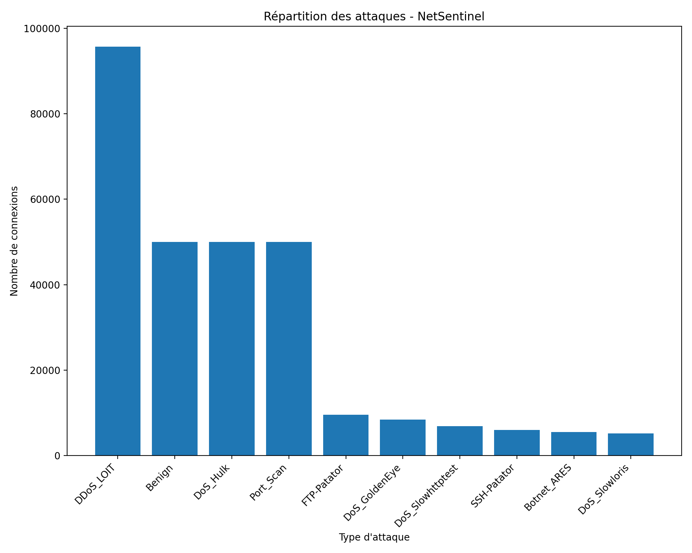
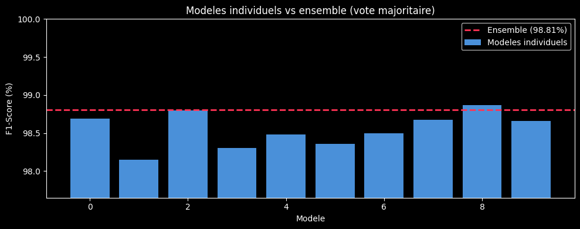
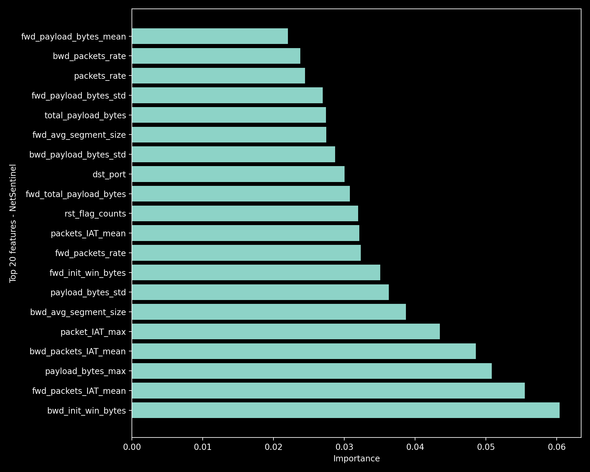
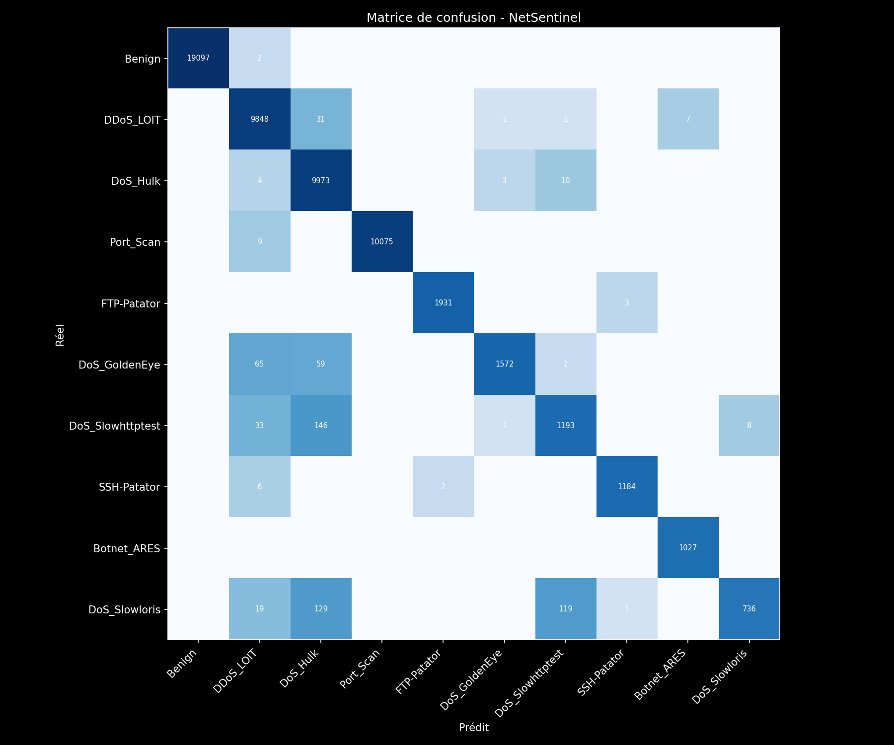

<div align="center">

# 🛡️ NetSentinel
### Système de détection d'intrusions réseau — Big Data & Machine Learning


</div>

---

## Contexte

Une grande entreprise industrielle génère en permanence des milliers de connexions réseau. Face à la montée des cyberattaques — DDoS, SQL Injection, Botnet, Brute Force... — le service IT a besoin d'un système capable d'**analyser le trafic réseau et de détecter les intrusions**, aussi bien sur l'historique qu'en temps réel.

C'est le problème que j'ai choisi de résoudre avec ce projet : construire un **IDS (Intrusion Detection System)** complet, de l'ingestion des données brutes jusqu'au dashboard de monitoring, en passant par l'entraînement d'un modèle de classification distribué avec Spark.

---

## Objectif

Construire un pipeline Big Data de détection d'intrusions réseau en deux phases :

- **Phase Batch** — analyser 2GB d'historique de trafic réseau, entraîner un modèle de classification capable d'identifier si une connexion est bénigne ou malveillante, et visualiser les résultats dans un dashboard SOC.
- **Phase Streaming** — simuler l'arrivée de nouvelles connexions en temps réel et alerter immédiatement le service IT dès qu'une intrusion est détectée.

---

## Dataset

**BCCC-CIC-IDS-2017** — Canadian Institute for Cybersecurity / MIT (2024)

> 2GB de trafic réseau labellisé — trafic normal + types d'attaques réelles capturées sur une infrastructure réseau complète sur une semaine entière.

| Caractéristique | Détail |
|---|---|
| Volume | ~2.8M connexions réseau |
| Features | 116 features par flux réseau |
| Classes | 15 (Benign + 14 types d'attaques) |
| Format | CSV par jour / type d'attaque |

**Types d'attaques couverts :** DoS Hulk, DDoS LOIT, PortScan, FTP-Patator, DoS GoldenEye, DoS Slowhttptest, SSH-Patator, Botnet ARES, DoS Slowloris, Heartbleed, Web Brute Force, SQL Injection, XSS...

📦 [Télécharger le dataset sur Kaggle](https://www.kaggle.com/datasets/bcccdatasets/network-intrusion-detection?select=BCCC-CIC-IDS2017)

---

## Architecture du pipeline

```
data/raw (CSV)
     │
     ▼
┌─────────────────────────────────────────────────┐
│               PHASE BATCH (Spark)               │
│                                                 │
│  Ingestion CSV → Nettoyage → Feature Eng.       │
│       → ML (Random Forest x10)                  │
│       → Évaluation → Export Delta Lake          │
└──────────────────────┬──────────────────────────┘
                       │
              data/dashboard/ (Delta)
                       │
                       ▼
              ┌─────────────────┐
              │    Dashboard    │
              │  (Dash/Plotly)  │
              └─────────────────┘

data/models/ (10 RF sauvegardés)
     │
     ▼
┌─────────────────────────────────────────────────┐
│            PHASE STREAMING (Spark)              │
│                                                 │
│  Flux réseau → Modèle chargé → Prédiction       │
│              → Alertes IT en temps réel         │
└─────────────────────────────────────────────────┘
```

---

## Phase Batch

### 1. Ingestion & équilibrage des classes

Je charge l'ensemble des CSV avec Spark et je constate immédiatement un **fort déséquilibre des classes** : le trafic Benign représente à lui seul la majorité des données, et DoS_Hulk + Port_Scan écrasent les autres attaques.

Pour ne pas biaiser le modèle, j'ai décidé de :
- Limiter **Benign, DoS_Hulk et Port_Scan à 50 000 lignes** chacun
- Conserver **toutes les lignes** des autres classes d'attaques (plus rares, donc précieuses)
- Ne garder que les **10 classes les plus pertinentes** pour une entreprise

<div align="center">
  
  <p><em>Distribution des classes après équilibrage</em></p>
</div>

---

### 2. Nettoyage & feature engineering

Sur les **116 features** disponibles, j'en ai gardé une quarantaine. La logique est simple : moins de features = moins d'overfitting + moins de RAM = plus d'arbres possibles.

**Ce que j'ai gardé et pourquoi :**

| Groupe | Features | Pourquoi |
|---|---|---|
| Ports | `src_port`, `dst_port` | FTP-Patator → port 21, SSH-Patator → port 22 |
| Volume & débit | `duration`, `bytes_rate`, `packets_rate`... | Les DoS/DDoS génèrent un volume anormal |
| Taille des paquets | `payload_bytes_max/mean/std`... | Attaques = paquets très uniformes ou anormaux |
| Flags TCP | `syn`, `rst`, `ack`... | SYN flood = milliers de flags SYN |
| Timing IAT | `packets_IAT_mean/std`... | Script d'attaque = régulier, humain = irrégulier |
| Fenêtres TCP | `fwd/bwd_init_win_bytes` | SYN flood = fenêtre initiale nulle ou anormale |

**Ce que j'ai supprimé :** bulk features (redondantes avec le volume), header bytes (corrélés avec payload), flags ECE/CWR (quasi inexistants), active/idle features, subflow features.

J'ai aussi géré les cas pièges :
- Valeurs `inf/-inf` (divisions par zéro dans Spark) → remplacées par `null` **avant** le `dropna()`
- Colonne `protocol` → supprimée (quasi entièrement nulle après cast en double, déjà représentée par les flags TCP)

---

### 3. Machine Learning

#### Choix du modèle : Random Forest

J'ai choisi le **Random Forest** pour plusieurs raisons :
- Robuste au déséquilibre résiduel des classes
- Donne directement une **feature importance interprétable**
- Pas besoin de normalisation des features
- Fonctionne nativement avec Spark MLLib

#### Stratégie : ensemble de 10 modèles

Au lieu d'un seul gros modèle, j'ai entraîné **10 Random Forests indépendants** (50 arbres chacun, profondeur max 10, seed différente pour chaque). La prédiction finale = **vote majoritaire** (mode des 10 prédictions).

Cette approche donne :
- Des importances de features **statistiquement stables** (moyennées sur 10 modèles)
- Un vote plus robuste sur les cas limites entre deux classes proches

<div align="center">
  
  <p><em>F1-Score de chaque modèle individuel vs l'ensemble — le gain du bagging</em></p>
</div>

---

### 4. Feature Importance

<div align="center">
  
  <p><em>Top features — importance moyenne sur les 10 modèles</em></p>
</div>

Les features les plus discriminantes et ce qu'elles signifient concrètement :

- **`bwd_init_win_bytes`** — taille de fenêtre TCP initiale du serveur. En SYN flood, l'attaquant ouvre des milliers de connexions sans jamais répondre → fenêtre nulle ou anormale
- **`fwd_packets_IAT_mean`** — temps moyen entre deux paquets envoyés. Un humain est irrégulier (il lit, il clique, il réfléchit), un script d'attaque est régulier comme une horloge
- **`payload_bytes_std`** — écart-type des tailles de paquets. Faible = tous les paquets font la même taille = comportement de machine
- **`rst_flag_counts`** — flag RST = coupure soudaine de connexion TCP. Normal = rare, attaque = des centaines par seconde
- **`dst_port`** — FTP-Patator cible systématiquement le port 21, SSH-Patator le port 22 → signal direct

---

### 5. Évaluation

<div align="center">

| Métrique | Score |
|---|---|
| **Accuracy** | **98.85%** |
| **F1-Score** | **98.81%** |
| **Precision** | **98.88%** |
| **Recall** | **98.85%** |

</div>

**Matrice de confusion :**

<div align="center">
  
  <p><em>Matrice de confusion sur le test set (20% des données)</em></p>
</div>

La diagonale quasi parfaite confirme que le modèle confond très peu les classes. Les rares erreurs se concentrent sur **DoS_Slowloris** (recall 73%) et **DoS_Slowhttptest** (F1 88%) — deux attaques difficiles à distinguer car elles partagent le même principe : ouvrir des connexions lentes pour épuiser le serveur.

**Métriques détaillées par classe :**

| Classe | F1 | Precision | Recall | FN |
|---|---|---|---|---|
| DDoS_LOIT | 99.99% | 100.00% | 99.99% | 2 |
| Port_Scan | 99.96% | 100.00% | 99.91% | 9 |
| FTP-Patator | 99.90% | 99.95% | 99.84% | 3 |
| Botnet_ARES | 99.66% | 99.32% | 100.00% | 0 |
| SSH-Patator | 99.54% | 99.66% | 99.41% | 7 |
| Benign | 99.12% | 98.59% | 99.66% | 34 |
| DoS_Hulk | 98.03% | 96.29% | 99.83% | 17 |
| DoS_GoldenEye | 95.87% | 99.68% | 92.34% | 130 |
| DoS_Slowhttptest | 88.86% | 91.55% | 86.31% | 189 |
| **DoS_Slowloris** | **84.14%** | 98.92% | 73.21% | **269** |

---

### 6. Export & Dashboard

Les résultats sont exportés en **format Delta Lake** vers `data/dashboard/` et lus directement par le dashboard Dash.

Le dashboard répond à 4 questions concrètes qu'un analyste SOC se pose :

| Graphique | Question |
|---|---|
| Volume par type d'attaque | Qu'est-ce qui attaque et en quel volume ? |
| F1-Score par classe | Détecte-t-on bien chaque type de menace ? |
| Matrice de confusion | Qu'est-ce qu'on rate ou confond ? |
| Feature importance | Sur quels signaux repose la détection ? |

Un **filtre interactif** permet d'isoler n'importe quel type d'attaque pour voir ses métriques détaillées dans un tableau de drill-down.

---

## Phase Streaming

> 🚧 En cours de développement

La phase streaming charge les modèles entraînés (sans ré-entraînement) et les applique sur un flux de connexions réseau simulé en temps réel via Spark Structured Streaming.

```python
# chargement du modèle exporté
model = RandomForestClassificationModel.load("data/models/model_0")

# inférence sur le stream en temps réel
predictions = model.transform(stream_df)

# alerte immédiate si attaque détectée
alerts = predictions.filter(col("prediction") != benign_index)
```

---

## Lancer le projet

### Prérequis

```bash
pip install -r requirements.txt
```

Ou avec Docker :
```bash
docker-compose up
```

### Phase Batch

Ouvrir `warehouse/02_batch_analysis.ipynb` et exécuter les cellules dans l'ordre.

> Si le kernel a été redémarré, utiliser la **cellule de rechargement** (cell 0) pour charger directement les modèles et données sauvegardés — sans repasser par tout le preprocessing.

### Dashboard

```bash
python dashboard.py
# → http://localhost:8050
```

---

## Structure du projet

```
NetSentinel/
├── warehouse/
│   └── 02_batch_analysis.ipynb   # pipeline batch complet
├── dashboard.py                   # dashboard SOC interactif (Dash/Plotly)
├── data/
│   ├── *.csv                      # datasets bruts (CICIDS-2017)
│   ├── processed/                 # df_final.parquet
│   ├── models/                    # 10 modèles RF sauvegardés (model_0 → model_9)
│   ├── dashboard/                 # exports Delta Lake pour le dashboard
│   └── docs/                      # captures d'écran pour la doc
├── conf/
│   └── spark-defaults.conf
├── Dockerfile
└── docker-compose.yml
```

---

## Stack technique

| Outil | Usage |
|---|---|
| **Apache Spark / PySpark** | Traitement distribué des 2GB de données |
| **Spark MLLib** | Random Forest, StringIndexer, VectorAssembler, CrossValidator |
| **Delta Lake** | Stockage des exports pour le dashboard |
| **Dash / Plotly** | Dashboard SOC interactif |
| **Pandas / NumPy** | Post-traitement et analyses locales |
| **Matplotlib / sklearn** | Visualisations (P-R curves, corrélation, distributions) |
| **Docker** | Containerisation de l'environnement Spark |

---

<div align="center">
  <sub>Projet Big Data — HELMo BLOC 2 Q2 · 2025-2026</sub>
</div>
