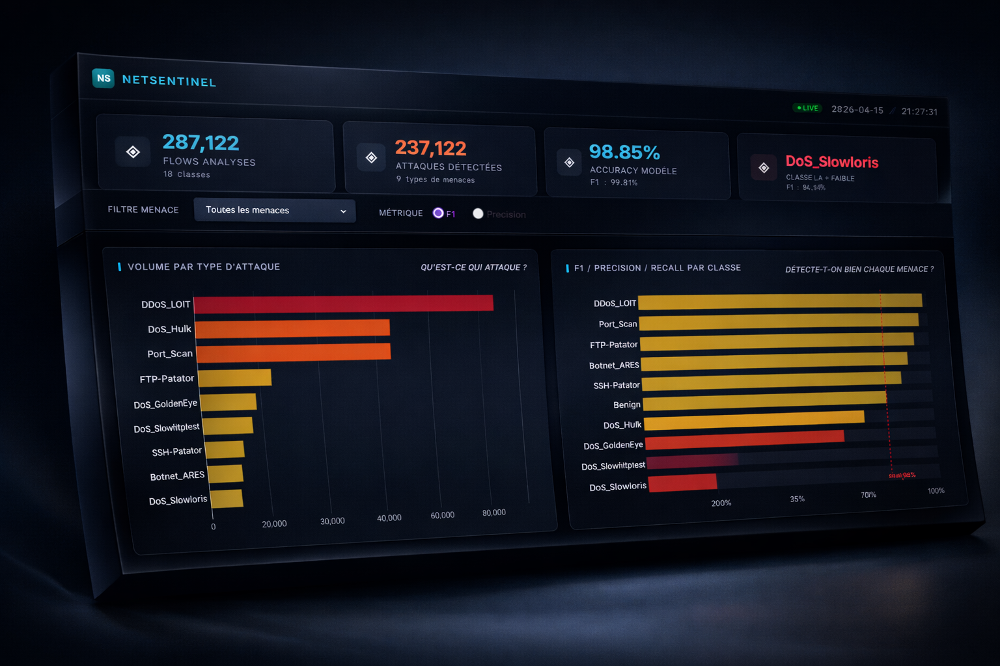
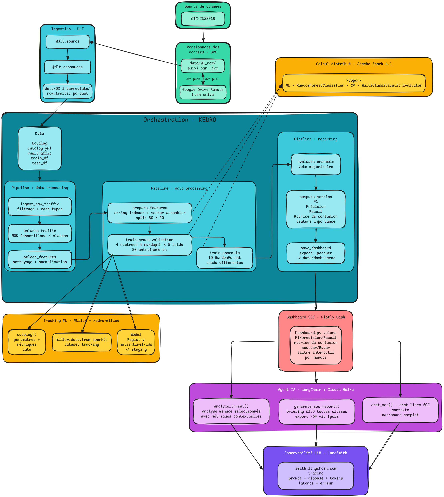

<div align="center">

# 🛡️ NetSentinel
### Système de détection d'intrusions réseau — Big Data & Machine Learning


</div>

---

<div align="center">
  
  <p><em>Dashboard NetSentinel</em></p>
</div>

---

## Contexte

Une grande entreprise industrielle génère en permanence des milliers de connexions réseau. Face à la montée des cyberattaques — DDoS, SQL Injection, Botnet, Brute Force... — le service IT a besoin d'un système capable d'**analyser le trafic réseau et de détecter les intrusions**, aussi bien sur l'historique qu'en temps réel.

C'est le problème que j'ai choisi de résoudre avec ce projet : construire un **IDS (Intrusion Detection System)** complet, de l'ingestion des données brutes jusqu'au dashboard de monitoring, en passant par l'entraînement d'un modèle de classification distribué avec Spark.

---

## Objectif

Construire un pipeline Big Data de détection d'intrusions réseau en deux phases :

- **Phase Batch** — analyser 2GB d'historique de trafic réseau, entraîner un modèle de classification capable d'identifier si une connexion est bénigne ou malveillante, et visualiser les résultats dans un dashboard SOC.
- **Phase Streaming** — simuler l'arrivée de nouvelles connexions en temps réel et alerter immédiatement le service IT dès qu'une intrusion est détectée.

---

## Dataset

**BCCC-CIC-IDS-2017** — Canadian Institute for Cybersecurity / MIT (2024)

> 2GB de trafic réseau labellisé — trafic normal + types d'attaques réelles capturées sur une infrastructure réseau complète sur une semaine entière.

| Caractéristique | Détail |
|---|---|
| Volume | ~2.6M connexions réseau |
| Features | 122 features par flux réseau |
| Classes | 15 (Benign + 14 types d'attaques) |
| Format | CSV par jour / type d'attaque |

**Types d'attaques couverts :** DoS Hulk, DDoS LOIT, PortScan, FTP-Patator, DoS GoldenEye, DoS Slowhttptest, SSH-Patator, Botnet ARES, DoS Slowloris, Heartbleed, Web Brute Force, SQL Injection, XSS...

📦 [Télécharger le dataset sur Kaggle](https://www.kaggle.com/datasets/bcccdatasets/network-intrusion-detection?select=BCCC-CIC-IDS2017)

---

## Architecture du pipeline

<div align="center">
  
  <p><em>Architecture Pipeline NetSentinel</em></p>
</div>

---

## Phase Batch

### 1. Ingestion & équilibrage des classes

Je charge l'ensemble des CSV avec Spark et je constate immédiatement un **fort déséquilibre des classes** : le trafic Benign représente à lui seul la majorité des données, et DoS_Hulk + Port_Scan écrasent les autres attaques.

Pour ne pas biaiser le modèle, j'ai décidé de :
- Limiter **Benign, DoS_Hulk et Port_Scan à 50 000 lignes** chacun — en utilisant `.orderBy(F.rand(seed=42)).limit(50000)` pour garantir un échantillonnage aléatoire reproductible
- Conserver **toutes les lignes** des autres classes d'attaques (plus rares, donc précieuses)
- Ne garder que les **10 classes les plus pertinentes** pour une entreprise

| Classe | Lignes brutes | Après équilibrage | Stratégie |
|---|---|---|---|
| Benign | 1,786,239 | 50,000 | Limité (sur-représenté) |
| DoS_Hulk | 349,240 | 50,000 | Limité (sur-représenté) |
| Port_Scan | 161,323 | 50,000 | Limité (sur-représenté) |
| DDoS_LOIT | 95,733 | 95,733 | Conservé intégralement |
| FTP-Patator | 9,531 | 9,531 | Conservé intégralement |
| DoS_GoldenEye | 8,364 | 8,364 | Conservé intégralement |
| DoS_Slowhttptest | 6,860 | 6,860 | Conservé intégralement |
| SSH-Patator | 5,949 | 5,949 | Conservé intégralement |
| Botnet_ARES | 5,508 | 5,508 | Conservé intégralement |
| DoS_Slowloris | 5,177 | 5,177 | Conservé intégralement |
| **TOTAL** | **2,610,292** | **287,122** | **11% gardé** |

<div align="center">
  
  <p><em>Distribution des classes après équilibrage</em></p>
</div>

---

### 2. Nettoyage & feature engineering

Sur les **122 features** disponibles, j'en ai gardé 45. La logique est simple : moins de features = moins d'overfitting + moins de RAM = plus d'arbres possibles.

**Ce que j'ai gardé et pourquoi :**

| Groupe | Features | Pourquoi |
|---|---|---|
| Ports | `src_port`, `dst_port` | FTP-Patator → port 21, SSH-Patator → port 22 |
| Volume & débit | `duration`, `bytes_rate`, `packets_rate`... | Les DoS/DDoS génèrent un volume anormal |
| Taille des paquets | `payload_bytes_max/mean/std`... | Attaques = paquets très uniformes ou anormaux |
| Flags TCP | `syn`, `rst`, `ack`... | SYN flood = milliers de flags SYN |
| Timing IAT | `packets_IAT_mean/std`... | Script d'attaque = régulier, humain = irrégulier |
| Fenêtres TCP | `fwd/bwd_init_win_bytes` | SYN flood = fenêtre initiale nulle ou anormale |

**Ce que j'ai supprimé :** bulk features (redondantes avec le volume), header bytes (corrélés avec payload), flags ECE/CWR (quasi inexistants), active/idle features, subflow features.

**Résultat : 122 → 45 colonnes (-63%)**, sans perte d'information discriminante.

J'ai aussi géré les cas pièges :
- Valeurs `inf/-inf` (divisions par zéro dans Spark) → remplacées par `null` **avant** le `dropna()`
- Colonne `protocol` → supprimée (quasi entièrement nulle après cast en double, déjà représentée par les flags TCP)

---

### 3. Machine Learning

#### 3.1 Choix du modèle : Random Forest

J'ai choisi le **Random Forest** pour plusieurs raisons :
- Robuste au déséquilibre résiduel des classes
- Donne directement une **feature importance interprétable**
- Pas besoin de normalisation des features
- Fonctionne nativement avec **Spark MLLib** en mode distribué

#### 3.2 Recherche d'hyperparamètres — CrossValidator

Pour trouver les meilleurs hyperparamètres **sans overfitter**, j'ai utilisé un `CrossValidator` Spark avec une `ParamGridBuilder` sur deux axes : le nombre d'arbres (`numTrees`) et la profondeur maximale (`maxDepth`).

**Grille explorée :**

| | numTrees = 30 | numTrees = 50 | numTrees = 75 | numTrees = 100 |
|---|---|---|---|---|
| **maxDepth = 5** | ✓ | ✓ | ✓ | ✓ |
| **maxDepth = 8** | ✓ | ✓ | ✓ | ✓ |
| **maxDepth = 10** | ✓ | ✓ | ✓ | ✓ |
| **maxDepth = 11** | ✓ | ✓ | ✓ | ✓ ← **optimal** |

**16 combinaisons × 5 folds = 80 Random Forests entraînés** — durée totale : 11.7 min.

**Problème rencontré : l'overfitting avec maxDepth élevée**

Lors d'un premier essai avec `maxDepth` jusqu'à 15, la CV trouvait systématiquement cette configuration comme optimale — mais avec un écart inquiétant entre le score CV et le score test :

| Configuration | F1 CV (5-fold) | F1 Test | Écart |
|---|---|---|---|
| numTrees=100, maxDepth=15 | 99.59% | ~97.5% | **~2.1%** ← overfit |
| numTrees=100, maxDepth=11 | 99.27% | 99.28% | **0.01%** ← stable ✓ |

Un arbre de profondeur 15 mémorise les données d'entraînement au lieu d'apprendre des patterns généralisables. En limitant à `maxDepth=11`, le modèle généralise correctement : l'écart CV/test tombe à 0.01%.

**Paramètres optimaux retenus :** `numTrees = 100` / `maxDepth = 11`

#### 3.3 Stratégie finale : ensemble de 10 modèles

Au lieu d'un seul gros modèle, j'ai entraîné **10 Random Forests indépendants** (100 arbres chacun, profondeur max 11, seed différente pour chaque). La prédiction finale = **vote majoritaire** (mode des 10 prédictions).

Cette approche donne :
- Des importances de features **statistiquement stables** (moyennées sur 10 modèles)
- Un vote plus robuste sur les cas limites entre deux classes proches
- **1000 arbres de décision au total** distribués sur 22 cores Spark

<div align="center">
  
  <p><em>F1-Score de chaque modèle individuel vs l'ensemble — le gain du bagging</em></p>
</div>

---

### 4. Feature Importance

<div align="center">
  
  <p><em>Top features — importance moyenne sur les 10 modèles</em></p>
</div>

Les features les plus discriminantes et ce qu'elles signifient concrètement :

- **`bwd_init_win_bytes`** — taille de fenêtre TCP initiale du serveur. En SYN flood, l'attaquant ouvre des milliers de connexions sans jamais répondre → fenêtre nulle ou anormale
- **`bwd_packets_IAT_mean`** — temps moyen entre les paquets renvoyés par le serveur. En DoS, le serveur répond de façon chaotique ou pas du tout
- **`fwd_packets_IAT_mean`** — temps moyen entre deux paquets envoyés. Un humain est irrégulier, un script d'attaque est régulier comme une horloge
- **`payload_bytes_max`** — taille maximale d'un paquet dans le flux. Certaines attaques envoient des paquets très petits pour saturer, d'autres très gros
- **`rst_flag_counts`** — flag RST = coupure soudaine de connexion TCP. Normal = rare, attaque = des centaines par seconde
- **`dst_port`** — FTP-Patator cible systématiquement le port 21, SSH-Patator le port 22 → signal direct

---

### 5. Évaluation

<div align="center">

| Métrique | Score |
|---|---|
| **Accuracy** | **99.30%** |
| **F1-Score** | **99.28%** |
| **Precision** | **99.29%** |
| **Recall** | **99.30%** |

</div>

**Matrice de confusion :**

<div align="center">
  
  <p><em>Matrice de confusion sur le test set (20% des données)</em></p>
</div>

La diagonale quasi parfaite confirme que le modèle confond très peu les classes. Les rares erreurs se concentrent sur **DoS_Slowloris** (recall 73%) et **DoS_Slowhttptest** (F1 88%) — deux attaques difficiles à distinguer car elles partagent le même principe : ouvrir des connexions lentes pour épuiser le serveur.

**Métriques détaillées par classe :**

| Classe | F1 | Precision | Recall | FN |
|---|---|---|---|---|
| DDoS_LOIT | 99.97% | 100.00% | 99.95% | 10 |
| FTP-Patator | 99.95% | 99.90% | 100.00% | 0 |
| Port_Scan | 99.91% | 99.99% | 99.83% | 17 |
| SSH-Patator | 99.71% | 100.00% | 99.41% | 7 |
| Benign | 99.63% | 99.42% | 99.84% | 16 |
| Botnet_ARES | 99.61% | 99.23% | 100.00% | 0 |
| DoS_GoldenEye | 99.32% | 99.47% | 99.18% | 14 |
| DoS_Hulk | 98.66% | 97.48% | 99.87% | 13 |
| DoS_Slowhttptest | 87.82% | 87.94% | 87.69% | 170 |
| **DoS_Slowloris** | **84.31%** | 98.66% | 73.61% | **265** |

**8 classes au-dessus de 99% de F1.** Les deux points faibles (DoS_Slowloris et DoS_Slowhttptest) partagent exactement le même mécanisme d'attaque — connexions lentes pour épuiser le serveur — ce qui rend leur séparation difficile même pour le modèle.

---

### 6. Export & Dashboard

Les résultats sont exportés en **format Delta Lake** vers `data/dashboard/` et lus directement par le dashboard Dash.

Le dashboard répond à 4 questions concrètes qu'un analyste SOC se pose :

| Graphique | Question |
|---|---|
| Volume par type d'attaque | Qu'est-ce qui attaque et en quel volume ? |
| Scatter Precision / Recall | Quels types d'attaques sont bien détectés vs ratés ? |
| Matrice de confusion | Qu'est-ce qu'on rate ou confond ? |
| Feature importance | Sur quels signaux repose la détection ? |
| Radar par classe | Vue 360° F1 / Precision / Recall pour une classe donnée |

Un **filtre interactif** permet d'isoler n'importe quel type d'attaque pour voir ses métriques détaillées dans un tableau de drill-down. Cliquer sur une barre ou une bulle met automatiquement à jour le filtre.

---

## Performance Big Data — Spark

### Pourquoi Spark ?

Ce projet justifie concrètement l'usage de Spark à trois niveaux :

1. **Volume** — 2.6M connexions réseau, 122 features → une lecture pandas chargerait tout en RAM et crasherait. Spark distribue la lecture sur 23 partitions en parallèle.
2. **Calcul distribué ML** — 80 Random Forests pour la CrossValidation + 10 pour l'ensemble = **90 modèles entraînés** sur le même dataset. Single-node, ça aurait pris des heures.
3. **Pipeline reproductible** — Spark MLLib (StringIndexer, VectorAssembler, CrossValidator) enchaîne preprocessing et ML dans un plan d'exécution optimisé et reproductible.

### Configuration Spark utilisée

| Paramètre | Valeur | Rôle |
|---|---|---|
| `spark.driver.memory` | 25g | Mémoire du driver (modèles, Pandas) |
| `spark.executor.memory` | 12g | Mémoire par exécuteur |
| `spark.executor.memoryOverhead` | 2g | Mémoire JVM hors-heap |
| `spark.driver.maxResultSize` | 4g | Limite collect() vers le driver |
| Parallélisme défaut | 22 | Nombre de cores disponibles |
| Partitions RDD (CSV) | 23 | 1 fichier CSV = 1 partition |

### Mesures de performance — pipeline complet

Chaque étape du pipeline est instrumentée avec `time.time()` dans le notebook :

| Étape | Durée | Observations |
|---|---|---|
| Ingestion CSV (2.6M lignes) | 22.8s | 23 partitions, 113K lignes/partition, scan parallèle |
| Équilibrage des classes | 21.2s | `orderBy(rand())` = shuffle complet entre partitions |
| Feature engineering (75 drops) | **0.3s** | Transformation **lazy** — aucune donnée lue |
| VectorAssembler + split | 82.5s | 3 actions Spark (StringIndexer.fit + 2× count) |
| CrossValidator (80 RF) | 703.7s | 11.7 min — étape dominante du pipeline |
| Ensemble 10 RF | 249.5s | ~25s/modèle, 1000 arbres au total |
| Inférence test set | 125.3s | 10 transforms séquentiels + vote UDF |
| Sauvegarde 10 modèles | 26.4s | 2.6s/modèle sérialisé sur disque |
| Export Delta Lake | 263.0s | Transaction logs + manifest files Delta |
| **TOTAL PIPELINE** | **1495s** | **25 minutes** |

### Lazy evaluation — démonstration concrète

L'une des observations les plus intéressantes du pipeline concerne le **feature engineering** :

```
Colonnes avant  : 122
Colonnes après  : 45 (-63%)
Durée .drop()   : 0.3s   ← 0 shuffle, 0 lecture disque
```

Supprimer 75 colonnes sur 2.6M lignes prend 0.3 secondes parce que `.drop()` est une **transformation lazy** — Spark met à jour son plan d'exécution (DAG) sans lire une seule ligne. La lecture réelle n'aura lieu qu'à la prochaine action (`.count()`, `.write()`, etc.).

C'est l'opposé de pandas où `df.drop(columns=[...])` lit et copie immédiatement les données en mémoire.

### Distribution et partitionnement

```
Dataset brut    : 2,610,292 lignes / 23 partitions / 22 cores
Lignes/partition: ~113,490  (distribution homogène)
Train set       : 229,655 lignes / 26 partitions
Test set        :  57,297 lignes / 26 partitions
```

Le split `randomSplit([0.8, 0.2])` ne déclenche pas de shuffle — il découpe chaque partition existante selon la probabilité. Le nombre de partitions reste identique (26 après l'union des DataFrames filtrés).

### Spark UI — suivi en temps réel

Le **Spark UI** (port 4040 pendant l'exécution, port 18080 pour l'History Server) permet d'inspecter :
- Le **DAG** de chaque job : comment Spark découpe le plan en stages séquentiels
- Le **détail de chaque stage** : nombre de tasks, shuffle read/write, durée
- La **mémoire par exécuteur** en temps réel
- Les **broadcast joins** : lors de l'inférence, chaque modèle RF (~65MB) est broadcasté depuis le driver vers les 22 workers

```
WARN DAGScheduler: Broadcasting large task binary with size 65.0 MiB
```
Ce warning apparaît 10 fois lors de l'inférence — une fois par modèle RF broadcasté. C'est le coût de l'ensemble : 10 × 65MB = 650MB de broadcast au total.

---

## Phase Streaming

> 🚧 En cours de développement

La phase streaming charge les modèles entraînés (sans ré-entraînement) et les applique sur un flux de connexions réseau simulé en temps réel via Spark Structured Streaming.

```python
# chargement du modèle exporté
model = RandomForestClassificationModel.load("data/models/model_0")

# inférence sur le stream en temps réel
predictions = model.transform(stream_df)

# alerte immédiate si attaque détectée
alerts = predictions.filter(col("prediction") != benign_index)
```

---

## Lancer le projet

### Prérequis

```bash
pip install -r requirements.txt
```

Ou avec Docker :
```bash
docker-compose up
```

### Phase Batch

Ouvrir `warehouse/02_batch_analysis.ipynb` et exécuter les cellules dans l'ordre.

> Si le kernel a été redémarré, utiliser la **cellule de rechargement** (cell 0) pour charger directement les modèles et données sauvegardés — sans repasser par tout le preprocessing.

### Dashboard

```bash
python dashboard.py
# → http://localhost:8050
```

---

## Structure du projet

```
NetSentinel/
├── warehouse/
│   └── 02_batch_analysis.ipynb   # pipeline batch complet
├── dashboard.py                   # dashboard SOC interactif (Dash/Plotly)
├── assets/
│   └── css/dashboard.css          # styles du dashboard
├── data/
│   ├── *.csv                      # datasets bruts (CICIDS-2017)
│   ├── processed/                 # df_final.parquet
│   ├── models/                    # 10 modèles RF sauvegardés (model_0 → model_9)
│   ├── dashboard/                 # exports Delta Lake pour le dashboard
│   └── docs/                      # captures d'écran pour la doc
├── conf/
│   └── spark-defaults.conf
├── Dockerfile
└── docker-compose.yml
```

---

## Stack technique

| Outil | Usage |
|---|---|
| **Apache Spark / PySpark** | Traitement distribué des 2.6M connexions réseau |
| **Spark MLLib** | Random Forest, StringIndexer, VectorAssembler, CrossValidator |
| **Delta Lake** | Stockage transactionnel des exports dashboard |
| **Dash / Plotly** | Dashboard SOC interactif (scatter, radar, heatmap) |
| **Pandas / NumPy** | Post-traitement et analyses locales |
| **Matplotlib / sklearn** | Visualisations (confusion matrix, feature importance) |
| **Docker** | Containerisation de l'environnement Spark |

---

<div align="center">
  <sub>Projet Big Data — HELMo BLOC 2 Q2 · 2025-2026</sub>
</div>
