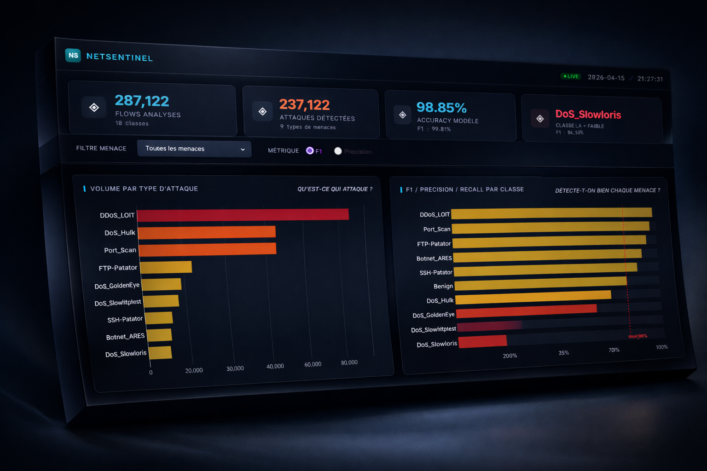
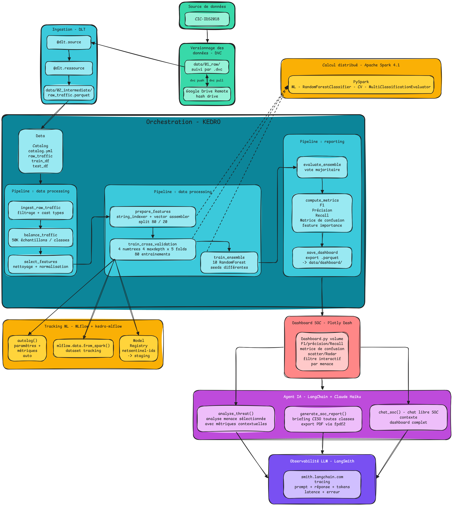
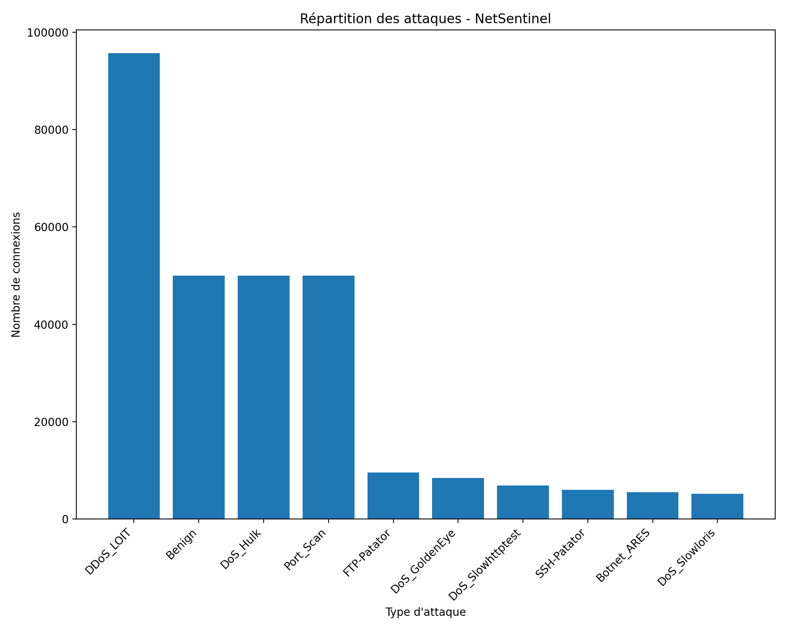
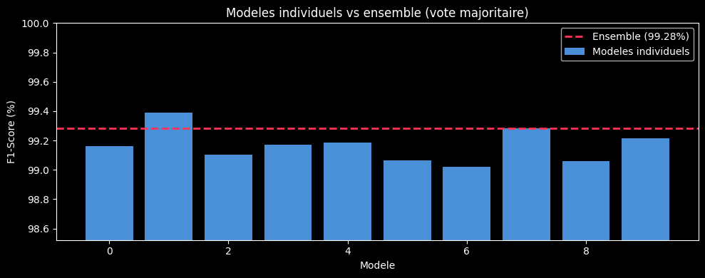
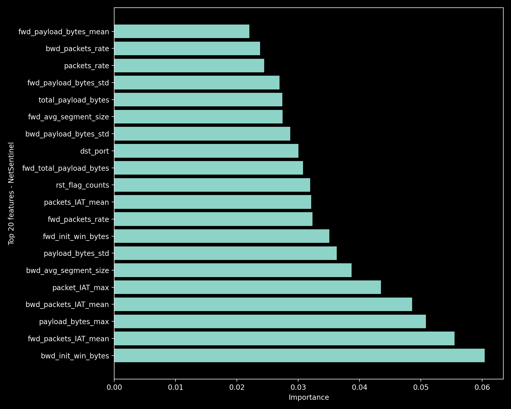
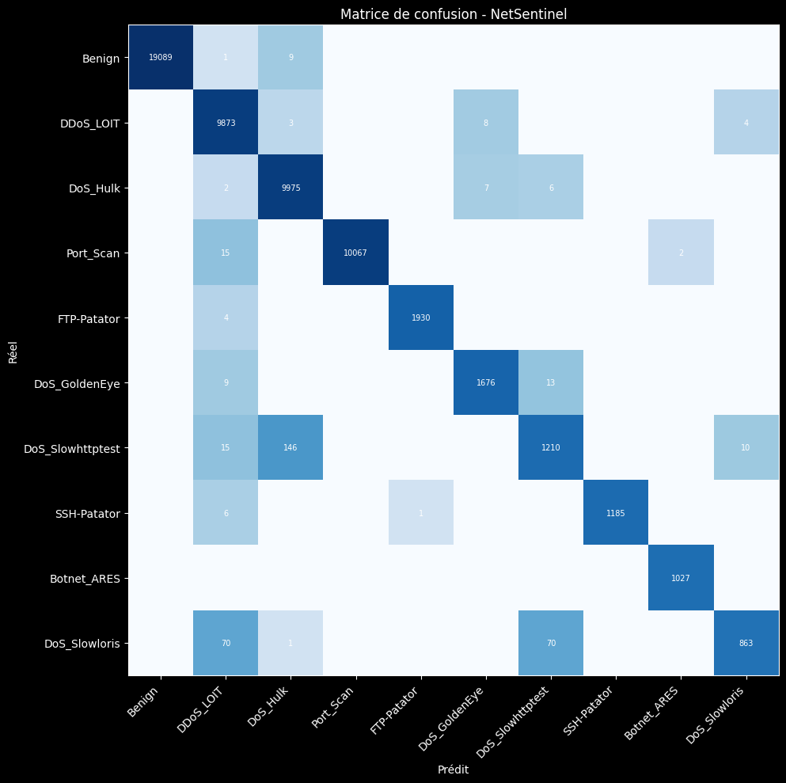

<div align="center">

# NetSentinel
### Système de détection d'intrusions réseau — Big Data & Machine Learning


</div>

---

<div align="center">
  
  <p><em>Dashboard live NetSentinel</em></p>
</div>

---

## Contexte

Une grande entreprise industrielle génère en permanence des milliers de connexions réseau. Face à la montée des cyberattaques — DDoS, SQL Injection, Botnet, Brute Force... — le service IT a besoin d'un système capable d'**analyser le trafic réseau et de détecter les intrusions**, aussi bien sur l'historique qu'en temps réel.

NetSentinel est un **IDS (Intrusion Detection System)** complet, de l'ingestion des données brutes jusqu'au dashboard de monitoring, en passant par l'entraînement d'un modèle de classification distribué avec Spark et une analyse IA des menaces via Claude Haiku.

---

## Objectif

Construire un pipeline Big Data de détection d'intrusions en deux phases :

- **Phase Batch** — analyser 2GB d'historique de trafic réseau, entraîner un modèle de classification, et visualiser les résultats dans un dashboard SOC.
- **Phase Streaming** — détecter les intrusions en temps réel via Kafka + Spark, alerter immédiatement et déclencher une analyse IA de la menace.

---

## Dataset

**BCCC-CIC-IDS-2017** — Canadian Institute for Cybersecurity (2024)

> 2GB de trafic réseau labellisé — trafic normal + types d'attaques réelles capturées sur une infrastructure réseau complète sur une semaine entière.

| Caractéristique | Détail |
|---|---|
| Volume | ~2.6M connexions réseau |
| Features | 122 features par flux réseau |
| Classes | 15 (Benign + 14 types d'attaques) |
| Format | CSV par jour / type d'attaque |

**Types d'attaques couverts :** DoS Hulk, DDoS LOIT, PortScan, FTP-Patator, DoS GoldenEye, DoS Slowhttptest, SSH-Patator, Botnet ARES, DoS Slowloris, Heartbleed, Web Brute Force, SQL Injection, XSS...

---

## Architecture du pipeline

<div align="center">
  
  <p><em>Architecture Pipeline NetSentinel</em></p>
</div>

---

## Phase Batch

### 1. Ingestion & équilibrage des classes

Je charge l'ensemble des CSV avec Spark et je constate immédiatement un **fort déséquilibre des classes** : le trafic Benign représente à lui seul la majorité des données, et DoS_Hulk + Port_Scan écrasent les autres attaques.

Pour ne pas biaiser le modèle :
- Limiter **Benign, DoS_Hulk et Port_Scan à 50 000 lignes** chacun — `orderBy(F.rand(seed=42)).limit(50000)` pour un échantillonnage aléatoire reproductible
- Conserver **toutes les lignes** des autres classes (plus rares, donc précieuses)
- Ne garder que les **10 classes les plus pertinentes** pour une entreprise

| Classe | Lignes brutes | Après équilibrage | Stratégie |
|---|---|---|---|
| Benign | 1,786,239 | 50,000 | Limité (sur-représenté) |
| DoS_Hulk | 349,240 | 50,000 | Limité (sur-représenté) |
| Port_Scan | 161,323 | 50,000 | Limité (sur-représenté) |
| DDoS_LOIT | 95,733 | 95,733 | Conservé intégralement |
| FTP-Patator | 9,531 | 9,531 | Conservé intégralement |
| DoS_GoldenEye | 8,364 | 8,364 | Conservé intégralement |
| DoS_Slowhttptest | 6,860 | 6,860 | Conservé intégralement |
| SSH-Patator | 5,949 | 5,949 | Conservé intégralement |
| Botnet_ARES | 5,508 | 5,508 | Conservé intégralement |
| DoS_Slowloris | 5,177 | 5,177 | Conservé intégralement |
| **TOTAL** | **2,610,292** | **287,122** | **11% gardé** |

<div align="center">
  
  <p><em>Distribution des classes après équilibrage</em></p>
</div>

---

### 2. Nettoyage & feature engineering

Sur les **122 features** disponibles, j'en ai gardé 45. Moins de features = moins d'overfitting + moins de RAM = plus d'arbres possibles.

| Groupe | Features | Pourquoi |
|---|---|---|
| Ports | `src_port`, `dst_port` | FTP-Patator → port 21, SSH-Patator → port 22 |
| Volume & débit | `duration`, `bytes_rate`, `packets_rate`... | Les DoS/DDoS génèrent un volume anormal |
| Taille des paquets | `payload_bytes_max/mean/std`... | Attaques = paquets très uniformes ou anormaux |
| Flags TCP | `syn`, `rst`, `ack`... | SYN flood = milliers de flags SYN |
| Timing IAT | `packets_IAT_mean/std`... | Script d'attaque = régulier, humain = irrégulier |
| Fenêtres TCP | `fwd/bwd_init_win_bytes` | SYN flood = fenêtre initiale nulle ou anormale |

**Résultat : 122 → 45 colonnes (-63%)**, sans perte d'information discriminante.

Cas pièges gérés :
- Valeurs `inf/-inf` (divisions par zéro dans Spark) → remplacées par `null` avant le `dropna()`
- Colonne `protocol` → supprimée (quasi entièrement nulle, déjà représentée par les flags TCP)

---

### 3. Machine Learning

#### 3.1 Choix du modèle : Random Forest

Choix du **Random Forest** car :
- Robuste au déséquilibre résiduel des classes
- Feature importance interprétable directement
- Pas besoin de normalisation
- Natif **Spark MLLib** en mode distribué

#### 3.2 Recherche d'hyperparamètres — CrossValidator

`CrossValidator` Spark avec `ParamGridBuilder` sur deux axes :

| | numTrees = 30 | numTrees = 50 | numTrees = 75 | numTrees = 100 |
|---|---|---|---|---|
| **maxDepth = 5** | ✓ | ✓ | ✓ | ✓ |
| **maxDepth = 8** | ✓ | ✓ | ✓ | ✓ |
| **maxDepth = 10** | ✓ | ✓ | ✓ | ✓ |
| **maxDepth = 11** | ✓ | ✓ | ✓ | ✓ ← **optimal** |

**16 combinaisons × 5 folds = 80 Random Forests entraînés** — durée totale : 11.7 min.

Problème rencontré avec `maxDepth=15` : overfitting flagrant (écart CV/test de 2.1%). En limitant à `maxDepth=11`, l'écart tombe à 0.01% :

| Configuration | F1 CV | F1 Test | Écart |
|---|---|---|---|
| numTrees=100, maxDepth=15 | 99.59% | ~97.5% | **~2.1%** ← overfit |
| numTrees=100, maxDepth=11 | 99.27% | 99.28% | **0.01%** ← stable |

#### 3.3 Ensemble de 10 modèles

Au lieu d'un seul modèle, j'ai entraîné **10 Random Forests indépendants** (100 arbres, profondeur 11, seed différente chacun). La prédiction finale = **vote majoritaire**.

- Importances de features statistiquement stables (moyennées sur 10 modèles)
- Vote robuste sur les cas limites
- **1000 arbres au total** distribués sur 22 cores Spark

<div align="center">
  
  <p><em>F1-Score de chaque modèle individuel vs l'ensemble</em></p>
</div>

---

### 4. Feature Importance

<div align="center">
  
  <p><em>Top features — importance moyenne sur les 10 modèles</em></p>
</div>

- **`bwd_init_win_bytes`** — fenêtre TCP initiale du serveur. En SYN flood, nulle ou anormale
- **`bwd_packets_IAT_mean`** — temps moyen entre paquets serveur. En DoS, chaotique ou nul
- **`fwd_packets_IAT_mean`** — humain = irrégulier, script d'attaque = régulier comme une horloge
- **`payload_bytes_max`** — certaines attaques envoient des paquets très petits pour saturer
- **`rst_flag_counts`** — coupure TCP soudaine. Normal = rare, attaque = des centaines/seconde
- **`dst_port`** — FTP-Patator → port 21, SSH-Patator → port 22, signal direct

---

### 5. Évaluation

<div align="center">

| Métrique | Score |
|---|---|
| **Accuracy** | **99.30%** |
| **F1-Score** | **99.28%** |
| **Precision** | **99.29%** |
| **Recall** | **99.30%** |

</div>

<div align="center">
  
  <p><em>Matrice de confusion sur le test set (20%)</em></p>
</div>

| Classe | F1 | Precision | Recall | FN |
|---|---|---|---|---|
| DDoS_LOIT | 99.97% | 100.00% | 99.95% | 10 |
| FTP-Patator | 99.95% | 99.90% | 100.00% | 0 |
| Port_Scan | 99.91% | 99.99% | 99.83% | 17 |
| SSH-Patator | 99.71% | 100.00% | 99.41% | 7 |
| Benign | 99.63% | 99.42% | 99.84% | 16 |
| Botnet_ARES | 99.61% | 99.23% | 100.00% | 0 |
| DoS_GoldenEye | 99.32% | 99.47% | 99.18% | 14 |
| DoS_Hulk | 98.66% | 97.48% | 99.87% | 13 |
| DoS_Slowhttptest | 87.82% | 87.94% | 87.69% | 170 |
| **DoS_Slowloris** | **84.31%** | 98.66% | 73.61% | **265** |

8 classes au-dessus de 99% de F1. Les deux points faibles (Slowloris / Slowhttptest) partagent le même mécanisme — connexions lentes pour épuiser le serveur — ce qui rend leur séparation difficile même pour le modèle.

---

## Performance Big Data — Spark

### Pourquoi Spark ?

1. **Volume** — 2.6M connexions, 122 features → pandas crasherait en RAM. Spark distribue sur 23 partitions en parallèle.
2. **Calcul distribué ML** — 80 RF pour la CrossValidation + 10 pour l'ensemble = 90 modèles entraînés en parallèle.
3. **Pipeline reproductible** — StringIndexer, VectorAssembler, CrossValidator enchaînés dans un plan d'exécution optimisé.

### Configuration Spark

| Paramètre | Valeur | Rôle |
|---|---|---|
| `spark.driver.memory` | 25g | Mémoire du driver |
| `spark.executor.memory` | 12g | Mémoire par exécuteur |
| `spark.executor.memoryOverhead` | 2g | Mémoire JVM hors-heap |
| `spark.driver.maxResultSize` | 4g | Limite collect() |
| Parallélisme | 22 | Nombre de cores |
| Partitions CSV | 23 | 1 fichier = 1 partition |

### Mesures de performance

| Étape | Durée | Observations |
|---|---|---|
| Ingestion CSV (2.6M lignes) | 22.8s | 23 partitions, scan parallèle |
| Équilibrage des classes | 21.2s | `orderBy(rand())` = shuffle complet |
| Feature engineering (75 drops) | **0.3s** | Transformation **lazy** — aucune donnée lue |
| VectorAssembler + split | 82.5s | 3 actions Spark |
| CrossValidator (80 RF) | 703.7s | 11.7 min — étape dominante |
| Ensemble 10 RF | 249.5s | ~25s/modèle |
| Inférence test set | 125.3s | 10 transforms + vote UDF |
| Export Delta Lake | 263.0s | Transaction logs Delta |
| **TOTAL** | **1495s** | **~25 minutes** |

### Lazy evaluation

```
Colonnes avant  : 122
Colonnes après  : 45 (-63%)
Duree .drop()   : 0.3s  <- 0 shuffle, 0 lecture disque
```

Supprimer 75 colonnes sur 2.6M lignes prend 0.3s car `.drop()` est **lazy** — Spark met à jour son DAG sans lire une seule ligne. L'opposé de pandas où le drop copie immédiatement les données en mémoire.

---

## Phase Streaming

Le modèle entraîné en batch est rechargé (sans ré-entraînement) et appliqué en temps réel sur un flux de connexions réseau.

### Architecture streaming

```
nfstream / dataset_replay
        |
        v
  Kafka topic (port 9092)
        |
        v
  Spark RF inference  -->  epoch_XXXXXX.csv  -->  Dashboard Live (port 8060)
        |                                                 |
        v                                                 v
  Kafka consumer                                  Alerte modale
                                                        |
                                                        v
                                                 Claude Haiku (analyse IA)
                                                        |
                                                        v
                                                 LangSmith (observabilite)
```

### Composants

| Composant | Rôle |
|---|---|
| `streaming/live_capture.py` | Capture le trafic réseau réel avec nfstream et produit vers Kafka |
| `streaming/dataset_replay.py` | Rejoue le dataset CIC-IDS-2017 vers Kafka (mode démo) |
| `streaming/kafka_consumer.py` | Consomme Kafka, applique le modèle RF Spark, écrit les prédictions |
| `app.py` | Dashboard live Dash — KPIs, flux réseau, graphiques, alertes |
| `dashboard.py` | Dashboard batch Dash — métriques modèle, analyse SOC |

### Analyse IA des menaces

Quand une attaque est détectée, une alerte modale propose une analyse par **Claude Haiku** (Anthropic). Le LLM génère en quelques secondes :
- Le mécanisme de l'attaque
- Les features réseau discriminantes
- Le risque des faux négatifs
- Des recommandations SOC concrètes

Les traces LLM sont suivies dans **LangSmith** (endpoint EU) pour l'observabilité.

---

## Lancer le projet

### Prérequis

- Python 3.10+
- Docker Desktop
- Git

### Installation (une seule fois)

```powershell
git clone https://github.com/dlz-dev/NetSentinel.git
cd NetSentinel
.\setup.ps1
```

Le script `setup.ps1` fait dans l'ordre :
1. `git pull` — mise à jour du dépôt
2. Création du `.venv` Python
3. `pip install -e .` — toutes les dépendances
4. `dvc pull` — téléchargement des données depuis Google Drive (fenêtre d'auth)
5. `kedro run` — entraînement du modèle + génération des métriques

### Lancer la démo streaming

```powershell
.\start_demo.ps1
```

Lance automatiquement dans l'ordre : Docker (Kafka + Spark), dashboard batch, dashboard live, Kafka consumer. Ouvre les URLs dans le navigateur.

Ensuite, pour injecter du trafic :
```powershell
python streaming/dataset_replay.py
```

### Accès aux interfaces

| Interface | URL |
|---|---|
| Dashboard Live | http://127.0.0.1:8060 |
| Dashboard Batch | http://127.0.0.1:8050 |
| Kafka UI | http://localhost:8090 |
| Spark UI | http://localhost:8080 |
| MLflow | `mlflow ui` → http://127.0.0.1:5000 |

---

## Structure du projet

```
NetSentinel/
├── setup.ps1                          # installation complete (une seule fois)
├── start_demo.ps1                     # lancement de la demo streaming
├── app.py                             # dashboard live (port 8060)
├── dashboard.py                       # dashboard batch (port 8050)
├── streaming/
│   ├── live_capture.py                # capture reseau reelle (nfstream)
│   ├── dataset_replay.py              # replay dataset vers Kafka
│   ├── kafka_consumer.py              # inference RF + ecriture predictions
│   └── spark_model.py                 # chargement modele RF partage
├── src/netsentinel/
│   ├── pipelines/                     # pipelines Kedro (ingestion, training, reporting)
│   └── agent/threat_analyzer.py      # analyse IA via Claude Haiku + LangSmith
├── conf/
│   ├── base/                          # parametres Kedro
│   └── local/credentials.yml         # cles API (non versionnees)
├── data/                              # donnees (gerees par DVC)
├── mlruns/                            # experiences MLflow
├── assets/live/                       # CSS + animation pipeline
├── assets/                            # images et graphiques
├── docker-compose.yml                 # Kafka + Spark
└── pyproject.toml                     # dependances du projet
```

---

## Stack technique

| Outil | Usage |
|---|---|
| **Apache Spark / PySpark** | Traitement distribué des 2.6M connexions réseau |
| **Spark MLLib** | Random Forest, CrossValidator, VectorAssembler |
| **Apache Kafka** | Bus de messages pour le streaming temps réel |
| **nfstream** | Capture et analyse du trafic réseau |
| **Kedro** | Orchestration du pipeline batch |
| **MLflow** | Tracking des expériences et métriques modèle |
| **DVC** | Versioning des données (Google Drive) |
| **Dash / Plotly** | Dashboards SOC interactifs |
| **Claude Haiku** | Analyse IA des menaces détectées |
| **LangSmith** | Observabilité des appels LLM |
| **Docker** | Containerisation Kafka + Spark |

---

<div align="center">
  <sub>Projet Big Data — HELMo BLOC 2 Q2 · 2025-2026</sub>
</div>
